# Collection of all R excersizes
Below are all R excersizes and output

# Week 2


```r
 setwd('C:/Users/tuhe/Dropbox/02450_public/Exercises/tue_utillities/../02450Toolbox_R/Scripts/../')
source('setup.R')
```

```
## Apriori/runApriori.R :
## Apriori/writeAprioriFile.R :
## binarize.R :
## bmplot.R :
## categoric2numeric.R :
## clusterplot.R :
## clusterval.R :
## confmatplot.R :
## dbplot.R :
## discreternd.R :
## forwardSelection.R :
## gausKernelDensity.R :
## gmmposterior.Mclust.R :
## gmmposterior.mixEM.R :
## gmmposterior.R :
## is.scalar.R :
## is.wholenumber.R :
## logLik.Mclust.R :
## logLik.mixEM.R :
## max_idx.R :
## naiveBayes.R :
## plot.nnet.R :
## predict.naiveBayes.R :
## rocplot.R :
## similarity.R :
## standardize.R :
```

```r
source('Scripts/ex2_1_1.R')
source('Scripts/ex2_1_2.R')
```

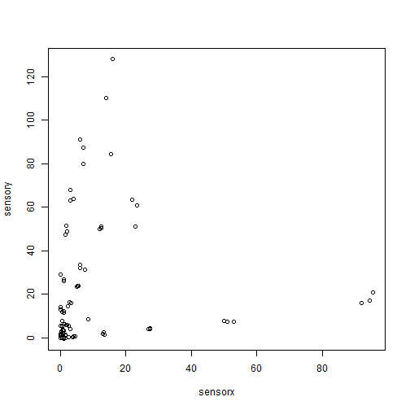  

```r
source('Scripts/ex2_1_3.R')
```

 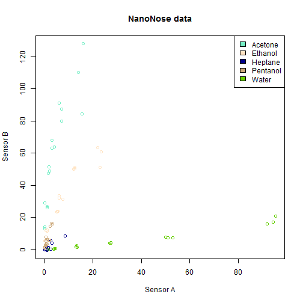  

```r
source('Scripts/ex2_1_4.R')
```

  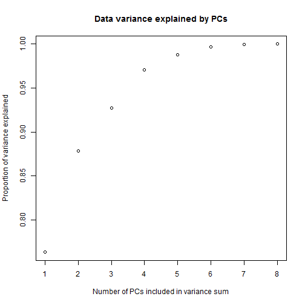 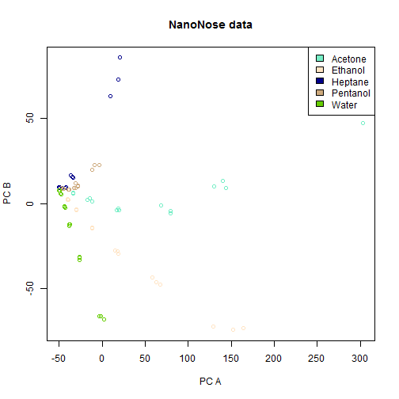 

```r
source('Scripts/ex2_1_5.R')
```

    

```
## [1] -0.37750816 -0.06815082  0.04400564 -0.05168758 -0.61769716 -0.04367914
## [7]  0.03584903  0.68080258
```

```r
source('Scripts/ex2_2_1.R')
```

```
## R.matlab v3.1.1 (2014-10-10) successfully loaded. See ?R.matlab for help.
## 
## Attaching package: 'R.matlab'
## 
## The following objects are masked from 'package:base':
## 
##     getOption, isOpen
```

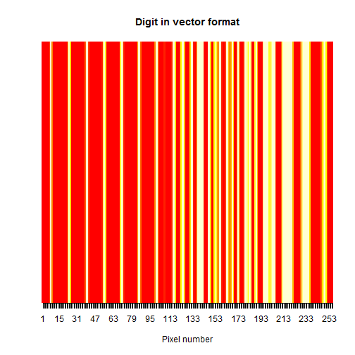 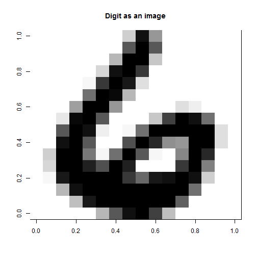 

```r
source('Scripts/ex2_2_2.R')
```

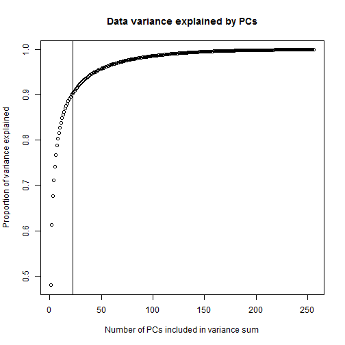 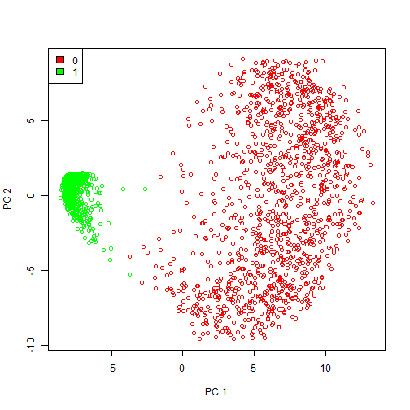 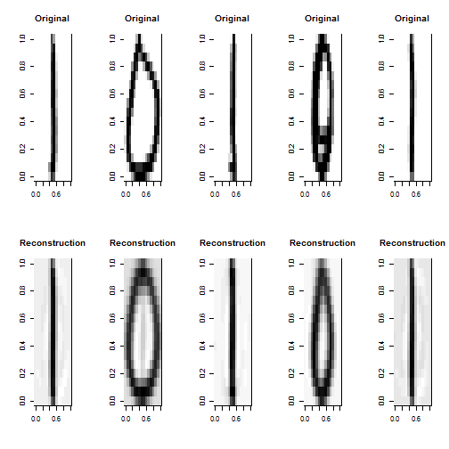 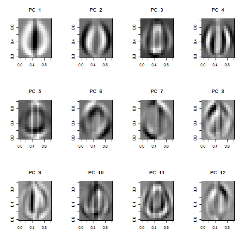 

```r
source('Scripts/ex2_3_1.R')
```

```
## [1] 0.006420546
```
 


# Week 3


```r
 setwd('C:/Users/tuhe/Dropbox/02450_public/Exercises/tue_utillities/../02450Toolbox_R/Scripts/../')
source('setup.R')
```

```
## Apriori/runApriori.R :
## Apriori/writeAprioriFile.R :
## binarize.R :
## bmplot.R :
## categoric2numeric.R :
## clusterplot.R :
## clusterval.R :
## confmatplot.R :
## dbplot.R :
## discreternd.R :
## forwardSelection.R :
## gausKernelDensity.R :
## gmmposterior.Mclust.R :
## gmmposterior.mixEM.R :
## gmmposterior.R :
## is.scalar.R :
## is.wholenumber.R :
## logLik.Mclust.R :
## logLik.mixEM.R :
## max_idx.R :
## naiveBayes.R :
## plot.nnet.R :
## predict.naiveBayes.R :
## rocplot.R :
## similarity.R :
## standardize.R :
```

```r
source('Scripts/ex3_1_2.R')
```

```
## Loading required package: NLP
```

```
## <<VCorpus (documents: 6, metadata (corpus/indexed): 0/0)>>
## 
## [[1]]
## <<PlainTextDocument (metadata: 7)>>
## The Google matrix P is a model of the internet.
## 
## P_ij is nonzero if there is a link from webpage i to j.
## 
## The Google matrix is used to rank all Web pages.
## 
## The ranking is done by solving a matrix eigenvalue problem.
## 
## England dropped out of the top 10 in the FIFA ranking.
## 
## 
## [[2]]
## <<PlainTextDocument (metadata: 7)>>
## The Google matrix P is a model of the internet.
## 
## 
## [[3]]
## <<PlainTextDocument (metadata: 7)>>
## P_ij is nonzero if there is a link from webpage i to j.
## 
## [[4]]
## <<PlainTextDocument (metadata: 7)>>
## The Google matrix is used to rank all Web pages.
## 
## 
## [[5]]
## <<PlainTextDocument (metadata: 7)>>
## The ranking is done by solving a matrix eigenvalue problem.
## 
## 
## [[6]]
## <<PlainTextDocument (metadata: 7)>>
## England dropped out of the top 10 in the FIFA ranking.
## 
## 
## <<DocumentTermMatrix (documents: 6, terms: 26)>>
## Non-/sparse entries: 59/97
## Sparsity           : 62%
## Maximal term length: 10
## Weighting          : term frequency (tf)
## 
##                Terms
## Docs            all done dropped eigenvalue england fifa from google
##   textDocs.txt    1    1       1          1       1    1    1      2
##   textDocs1.txt   0    0       0          0       0    0    0      1
##   textDocs2.txt   0    0       0          0       0    0    1      0
##   textDocs3.txt   1    0       0          0       0    0    0      1
##   textDocs4.txt   0    1       0          1       0    0    0      0
##   textDocs5.txt   0    0       1          0       1    1    0      0
##                Terms
## Docs            internet link matrix model nonzero out pages pij problem
##   textDocs.txt         1    1      3     1       1   1     1   1       1
##   textDocs1.txt        1    0      1     1       0   0     0   0       0
##   textDocs2.txt        0    1      0     0       1   0     0   1       0
##   textDocs3.txt        0    0      1     0       0   0     1   0       0
##   textDocs4.txt        0    0      1     0       0   0     0   0       1
##   textDocs5.txt        0    0      0     0       0   1     0   0       0
##                Terms
## Docs            rank ranking solving the there top used web webpage
##   textDocs.txt     1       2       1   6     1   1    1   1       1
##   textDocs1.txt    0       0       0   2     0   0    0   0       0
##   textDocs2.txt    0       0       0   0     1   0    0   0       1
##   textDocs3.txt    1       0       0   1     0   0    1   1       0
##   textDocs4.txt    0       1       1   1     0   0    0   0       0
##   textDocs5.txt    0       1       0   2     0   1    0   0       0
```

```r
source('Scripts/ex3_1_3.R')
```

```
## <<VCorpus (documents: 6, metadata (corpus/indexed): 0/0)>>
## 
## [[1]]
## <<PlainTextDocument (metadata: 7)>>
## The Google matrix P is a model of the internet.
## 
## P_ij is nonzero if there is a link from webpage i to j.
## 
## The Google matrix is used to rank all Web pages.
## 
## The ranking is done by solving a matrix eigenvalue problem.
## 
## England dropped out of the top 10 in the FIFA ranking.
## 
## 
## [[2]]
## <<PlainTextDocument (metadata: 7)>>
## The Google matrix P is a model of the internet.
## 
## 
## [[3]]
## <<PlainTextDocument (metadata: 7)>>
## P_ij is nonzero if there is a link from webpage i to j.
## 
## [[4]]
## <<PlainTextDocument (metadata: 7)>>
## The Google matrix is used to rank all Web pages.
## 
## 
## [[5]]
## <<PlainTextDocument (metadata: 7)>>
## The ranking is done by solving a matrix eigenvalue problem.
## 
## 
## [[6]]
## <<PlainTextDocument (metadata: 7)>>
## England dropped out of the top 10 in the FIFA ranking.
## 
## 
## <<VCorpus (documents: 6, metadata (corpus/indexed): 0/0)>>
## 
## [[1]]
## <<PlainTextDocument (metadata: 7)>>
## The Google matrix P   model   internet.
## 
## P_ij  nonzero     link  webpage   .
## 
## The Google matrix    rank  Web pages.
## 
## The ranking    solving  matrix eigenvalue problem.
## 
## England dropped    top 10   FIFA ranking.
## 
## 
## [[2]]
## <<PlainTextDocument (metadata: 7)>>
## The Google matrix P   model   internet.
## 
## 
## [[3]]
## <<PlainTextDocument (metadata: 7)>>
## P_ij  nonzero     link  webpage   .
## 
## [[4]]
## <<PlainTextDocument (metadata: 7)>>
## The Google matrix    rank  Web pages.
## 
## 
## [[5]]
## <<PlainTextDocument (metadata: 7)>>
## The ranking    solving  matrix eigenvalue problem.
## 
## 
## [[6]]
## <<PlainTextDocument (metadata: 7)>>
## England dropped    top 10   FIFA ranking.
## 
## 
## <<DocumentTermMatrix (documents: 6, terms: 19)>>
## Non-/sparse entries: 42/72
## Sparsity           : 63%
## Maximal term length: 10
## Weighting          : term frequency (tf)
## 
##                Terms
## Docs            dropped eigenvalue england fifa google internet link
##   textDocs.txt        1          1       1    1      2        1    1
##   textDocs1.txt       0          0       0    0      1        1    0
##   textDocs2.txt       0          0       0    0      0        0    1
##   textDocs3.txt       0          0       0    0      1        0    0
##   textDocs4.txt       0          1       0    0      0        0    0
##   textDocs5.txt       1          0       1    1      0        0    0
##                Terms
## Docs            matrix model nonzero pages pij problem rank ranking
##   textDocs.txt       3     1       1     1   1       1    1       2
##   textDocs1.txt      1     1       0     0   0       0    0       0
##   textDocs2.txt      0     0       1     0   1       0    0       0
##   textDocs3.txt      1     0       0     1   0       0    1       0
##   textDocs4.txt      1     0       0     0   0       1    0       1
##   textDocs5.txt      0     0       0     0   0       0    0       1
##                Terms
## Docs            solving top web webpage
##   textDocs.txt        1   1   1       1
##   textDocs1.txt       0   0   0       0
##   textDocs2.txt       0   0   0       1
##   textDocs3.txt       0   0   1       0
##   textDocs4.txt       1   0   0       0
##   textDocs5.txt       0   1   0       0
```

```r
source('Scripts/ex3_1_4.R')
```

```
## <<VCorpus (documents: 6, metadata (corpus/indexed): 0/0)>>
## 
## [[1]]
## <<PlainTextDocument (metadata: 7)>>
## The Google matrix P is a model of the internet.
## 
## P_ij is nonzero if there is a link from webpage i to j.
## 
## The Google matrix is used to rank all Web pages.
## 
## The ranking is done by solving a matrix eigenvalue problem.
## 
## England dropped out of the top 10 in the FIFA ranking.
## 
## 
## [[2]]
## <<PlainTextDocument (metadata: 7)>>
## The Google matrix P is a model of the internet.
## 
## 
## [[3]]
## <<PlainTextDocument (metadata: 7)>>
## P_ij is nonzero if there is a link from webpage i to j.
## 
## [[4]]
## <<PlainTextDocument (metadata: 7)>>
## The Google matrix is used to rank all Web pages.
## 
## 
## [[5]]
## <<PlainTextDocument (metadata: 7)>>
## The ranking is done by solving a matrix eigenvalue problem.
## 
## 
## [[6]]
## <<PlainTextDocument (metadata: 7)>>
## England dropped out of the top 10 in the FIFA ranking.
## 
## 
## <<DocumentTermMatrix (documents: 6, terms: 18)>>
## Non-/sparse entries: 40/68
## Sparsity           : 63%
## Maximal term length: 10
## Weighting          : term frequency (tf)
## 
##                Terms
## Docs            dropped eigenvalue england fifa google internet link
##   textDocs.txt        1          1       1    1      2        1    1
##   textDocs1.txt       0          0       0    0      1        1    0
##   textDocs2.txt       0          0       0    0      0        0    1
##   textDocs3.txt       0          0       0    0      1        0    0
##   textDocs4.txt       0          1       0    0      0        0    0
##   textDocs5.txt       1          0       1    1      0        0    0
##                Terms
## Docs            matrix model nonzero pages problem rank ranking solving
##   textDocs.txt       3     1       1     1       1    1       2       1
##   textDocs1.txt      1     1       0     0       0    0       0       0
##   textDocs2.txt      0     0       1     0       0    0       0       0
##   textDocs3.txt      1     0       0     1       0    1       0       0
##   textDocs4.txt      1     0       0     0       1    0       1       1
##   textDocs5.txt      0     0       0     0       0    0       1       0
##                Terms
## Docs            top web webpage
##   textDocs.txt    1   1       1
##   textDocs1.txt   0   0       0
##   textDocs2.txt   0   0       1
##   textDocs3.txt   0   1       0
##   textDocs4.txt   0   0       0
##   textDocs5.txt   1   0       0
## <<VCorpus (documents: 6, metadata (corpus/indexed): 0/0)>>
## 
## [[1]]
## <<PlainTextDocument (metadata: 7)>>
## The Googl matrix P   model   internet
## 
##   nonzero     link  webpag  
## 
## The Googl matrix    rank  Web page
## 
## The rank    solv  matrix eigenvalu problem
## 
## England drop    top 10   FIFA rank
## 
## 
## [[2]]
## <<PlainTextDocument (metadata: 7)>>
## The Googl matrix P   model   internet
## 
## 
## [[3]]
## <<PlainTextDocument (metadata: 7)>>
##   nonzero     link  webpag  
## 
## [[4]]
## <<PlainTextDocument (metadata: 7)>>
## The Googl matrix    rank  Web page
## 
## 
## [[5]]
## <<PlainTextDocument (metadata: 7)>>
## The rank    solv  matrix eigenvalu problem
## 
## 
## [[6]]
## <<PlainTextDocument (metadata: 7)>>
## England drop    top 10   FIFA rank
## 
## 
## <<DocumentTermMatrix (documents: 6, terms: 17)>>
## Non-/sparse entries: 39/63
## Sparsity           : 62%
## Maximal term length: 9
## Weighting          : term frequency (tf)
## 
##                Terms
## Docs            drop eigenvalu england fifa googl internet link matrix
##   textDocs.txt     1         1       1    1     2        1    1      3
##   textDocs1.txt    0         0       0    0     1        1    0      1
##   textDocs2.txt    0         0       0    0     0        0    1      0
##   textDocs3.txt    0         0       0    0     1        0    0      1
##   textDocs4.txt    0         1       0    0     0        0    0      1
##   textDocs5.txt    1         0       1    1     0        0    0      0
##                Terms
## Docs            model nonzero page problem rank solv top web webpag
##   textDocs.txt      1       1    1       1    3    1   1   1      1
##   textDocs1.txt     1       0    0       0    0    0   0   0      0
##   textDocs2.txt     0       1    0       0    0    0   0   0      1
##   textDocs3.txt     0       0    1       0    1    0   0   1      0
##   textDocs4.txt     0       0    0       1    1    1   0   0      0
##   textDocs5.txt     0       0    0       0    1    0   1   0      0
```

```r
source('Scripts/ex3_1_5.R')
```

```
## <<VCorpus (documents: 6, metadata (corpus/indexed): 0/0)>>
## 
## [[1]]
## <<PlainTextDocument (metadata: 7)>>
## The Google matrix P is a model of the internet.
## 
## P_ij is nonzero if there is a link from webpage i to j.
## 
## The Google matrix is used to rank all Web pages.
## 
## The ranking is done by solving a matrix eigenvalue problem.
## 
## England dropped out of the top 10 in the FIFA ranking.
## 
## 
## [[2]]
## <<PlainTextDocument (metadata: 7)>>
## The Google matrix P is a model of the internet.
## 
## 
## [[3]]
## <<PlainTextDocument (metadata: 7)>>
## P_ij is nonzero if there is a link from webpage i to j.
## 
## [[4]]
## <<PlainTextDocument (metadata: 7)>>
## The Google matrix is used to rank all Web pages.
## 
## 
## [[5]]
## <<PlainTextDocument (metadata: 7)>>
## The ranking is done by solving a matrix eigenvalue problem.
## 
## 
## [[6]]
## <<PlainTextDocument (metadata: 7)>>
## England dropped out of the top 10 in the FIFA ranking.
## 
## 
## <<DocumentTermMatrix (documents: 6, terms: 18)>>
## Non-/sparse entries: 40/68
## Sparsity           : 63%
## Maximal term length: 10
## Weighting          : term frequency (tf)
## 
##                Terms
## Docs            dropped eigenvalue england fifa google internet link
##   textDocs.txt        1          1       1    1      2        1    1
##   textDocs1.txt       0          0       0    0      1        1    0
##   textDocs2.txt       0          0       0    0      0        0    1
##   textDocs3.txt       0          0       0    0      1        0    0
##   textDocs4.txt       0          1       0    0      0        0    0
##   textDocs5.txt       1          0       1    1      0        0    0
##                Terms
## Docs            matrix model nonzero pages problem rank ranking solving
##   textDocs.txt       3     1       1     1       1    1       2       1
##   textDocs1.txt      1     1       0     0       0    0       0       0
##   textDocs2.txt      0     0       1     0       0    0       0       0
##   textDocs3.txt      1     0       0     1       0    1       0       0
##   textDocs4.txt      1     0       0     0       1    0       1       1
##   textDocs5.txt      0     0       0     0       0    0       1       0
##                Terms
## Docs            top web webpage
##   textDocs.txt    1   1       1
##   textDocs1.txt   0   0       0
##   textDocs2.txt   0   0       1
##   textDocs3.txt   0   1       0
##   textDocs4.txt   0   0       0
##   textDocs5.txt   1   0       0
## <<VCorpus (documents: 6, metadata (corpus/indexed): 0/0)>>
## 
## [[1]]
## <<PlainTextDocument (metadata: 7)>>
## The Googl matrix P   model   internet
## 
##   nonzero     link  webpag  
## 
## The Googl matrix    rank  Web page
## 
## The rank    solv  matrix eigenvalu problem
## 
## England drop    top 10   FIFA rank
## 
## 
## [[2]]
## <<PlainTextDocument (metadata: 7)>>
## The Googl matrix P   model   internet
## 
## 
## [[3]]
## <<PlainTextDocument (metadata: 7)>>
##   nonzero     link  webpag  
## 
## [[4]]
## <<PlainTextDocument (metadata: 7)>>
## The Googl matrix    rank  Web page
## 
## 
## [[5]]
## <<PlainTextDocument (metadata: 7)>>
## The rank    solv  matrix eigenvalu problem
## 
## 
## [[6]]
## <<PlainTextDocument (metadata: 7)>>
## England drop    top 10   FIFA rank
## 
## 
## <<DocumentTermMatrix (documents: 6, terms: 17)>>
## Non-/sparse entries: 39/63
## Sparsity           : 62%
## Maximal term length: 9
## Weighting          : term frequency (tf)
## 
##                Terms
## Docs            drop eigenvalu england fifa googl internet link matrix
##   textDocs.txt     1         1       1    1     2        1    1      3
##   textDocs1.txt    0         0       0    0     1        1    0      1
##   textDocs2.txt    0         0       0    0     0        0    1      0
##   textDocs3.txt    0         0       0    0     1        0    0      1
##   textDocs4.txt    0         1       0    0     0        0    0      1
##   textDocs5.txt    1         0       1    1     0        0    0      0
##                Terms
## Docs            model nonzero page problem rank solv top web webpag
##   textDocs.txt      1       1    1       1    3    1   1   1      1
##   textDocs1.txt     1       0    0       0    0    0   0   0      0
##   textDocs2.txt     0       1    0       0    0    0   0   0      1
##   textDocs3.txt     0       0    1       0    1    0   0   1      0
##   textDocs4.txt     0       0    0       1    1    1   0   0      0
##   textDocs5.txt     0       0    0       0    1    0   1   0      0
```

```
## Loading required package: brew
## 
## Attaching package: 'sos'
## 
## The following object is masked from 'package:utils':
## 
##     ?
## 
## Loading required package: SnowballC
## 
## Attaching package: 'lsa'
## 
## The following object is masked from 'package:FNN':
## 
##     entropy
```

```
## [1] "Cosine similarity from q to docs: "
## [1] 0.6735753 0.2886751 0.0000000 0.5163978 0.7745967 0.2581989
```

```r
source('Scripts/ex3_2_1.R')
source('Scripts/ex3_3_1.R')
source('Scripts/ex3_3_2.R')
```
 


# Week 4


```r
 setwd('C:/Users/tuhe/Dropbox/02450_public/Exercises/tue_utillities/../02450Toolbox_R/Scripts/../')
source('setup.R')
```

```
## Apriori/runApriori.R :
## Apriori/writeAprioriFile.R :
## binarize.R :
## bmplot.R :
## categoric2numeric.R :
## clusterplot.R :
## clusterval.R :
## confmatplot.R :
## dbplot.R :
## discreternd.R :
## forwardSelection.R :
## gausKernelDensity.R :
## gmmposterior.Mclust.R :
## gmmposterior.mixEM.R :
## gmmposterior.R :
## is.scalar.R :
## is.wholenumber.R :
## logLik.Mclust.R :
## logLik.mixEM.R :
## max_idx.R :
## naiveBayes.R :
## plot.nnet.R :
## predict.naiveBayes.R :
## rocplot.R :
## similarity.R :
## standardize.R :
```

```r
source('Scripts/ex4_1_1.R')
source('Scripts/ex4_1_2.R')
```

```
## Apriori/runApriori.R :
## Apriori/writeAprioriFile.R :
## binarize.R :
## bmplot.R :
## categoric2numeric.R :
## clusterplot.R :
## clusterval.R :
## confmatplot.R :
## dbplot.R :
## discreternd.R :
## forwardSelection.R :
## gausKernelDensity.R :
## gmmposterior.Mclust.R :
## gmmposterior.mixEM.R :
## gmmposterior.R :
## is.scalar.R :
## is.wholenumber.R :
## logLik.Mclust.R :
## logLik.mixEM.R :
## max_idx.R :
## naiveBayes.R :
## plot.nnet.R :
## predict.naiveBayes.R :
## rocplot.R :
## similarity.R :
## standardize.R :
```

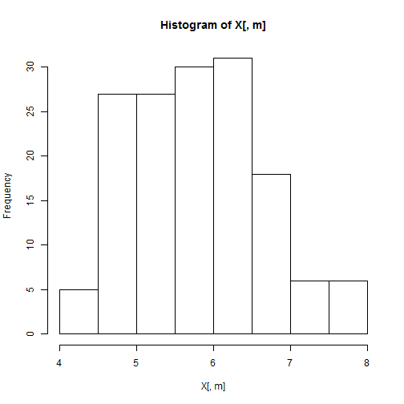 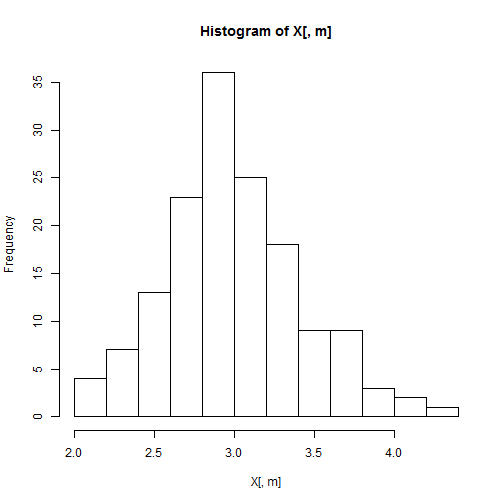 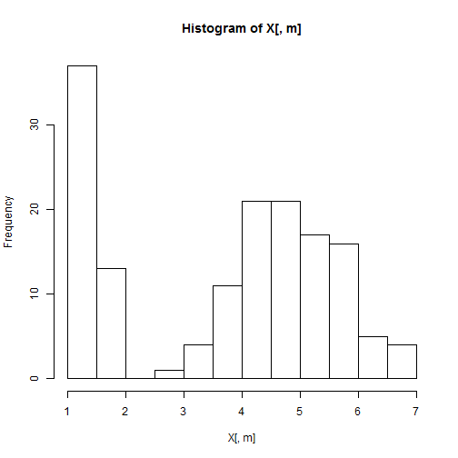 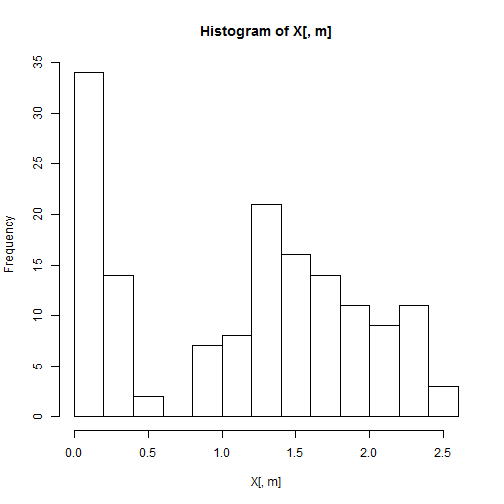 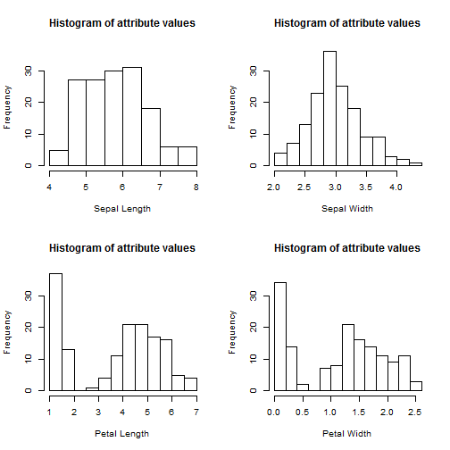 

```r
source('Scripts/ex4_1_3.R')
source('Scripts/ex4_1_4.R')
```

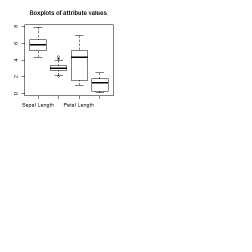 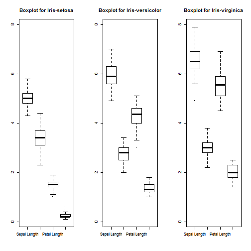 

```r
source('Scripts/ex4_1_5.R')
```

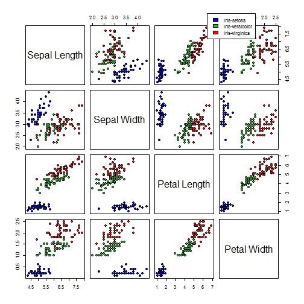 

```r
source('Scripts/ex4_1_6.R')
source('Scripts/ex4_1_7.R')
source('Scripts/ex4_2_1.R')
```

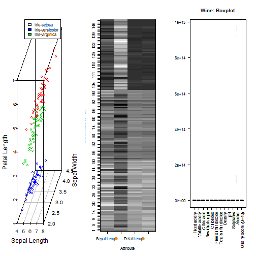 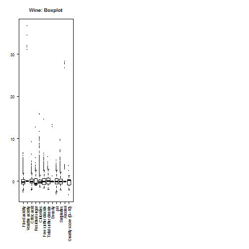 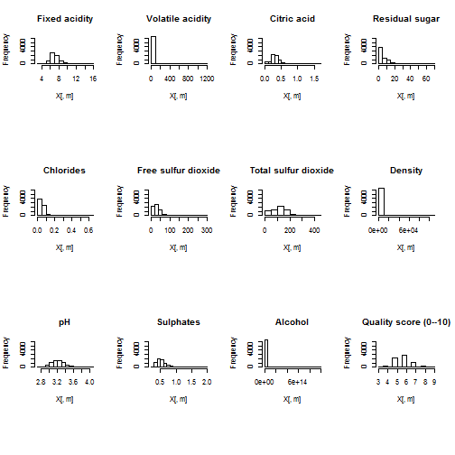 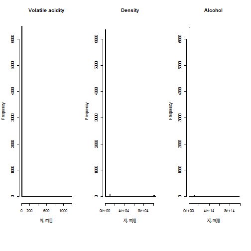 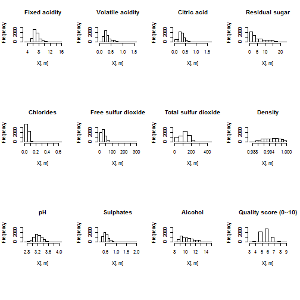 

```r
source('Scripts/ex4_2_2.R')
```

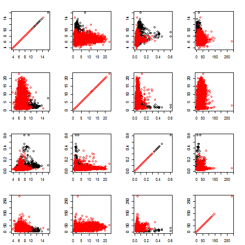 

```r
source('Scripts/ex4_3_1.R')
```

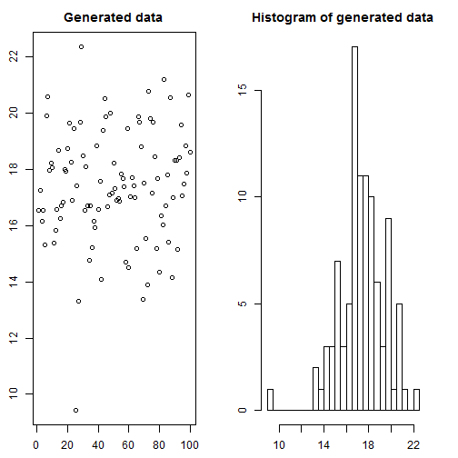 

```r
source('Scripts/ex4_3_2.R')
```

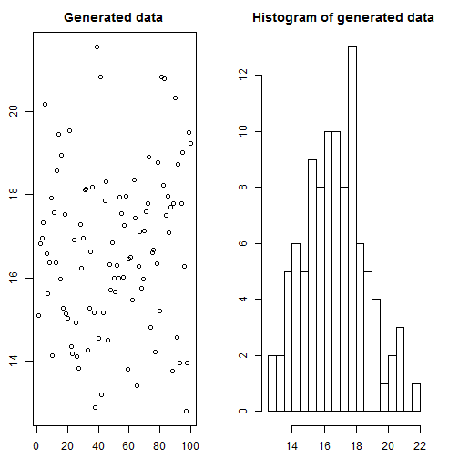 

```r
source('Scripts/ex4_3_3.R')
source('Scripts/ex4_3_4.R')
source('Scripts/ex4_3_5.R')
```

```
## 
## Attaching package: 'gplots'
## 
## The following object is masked from 'package:stats':
## 
##     lowess
```

```r
source('Scripts/ex4_4_1.R')
source('Scripts/ex4_4_2.R')
```
 
